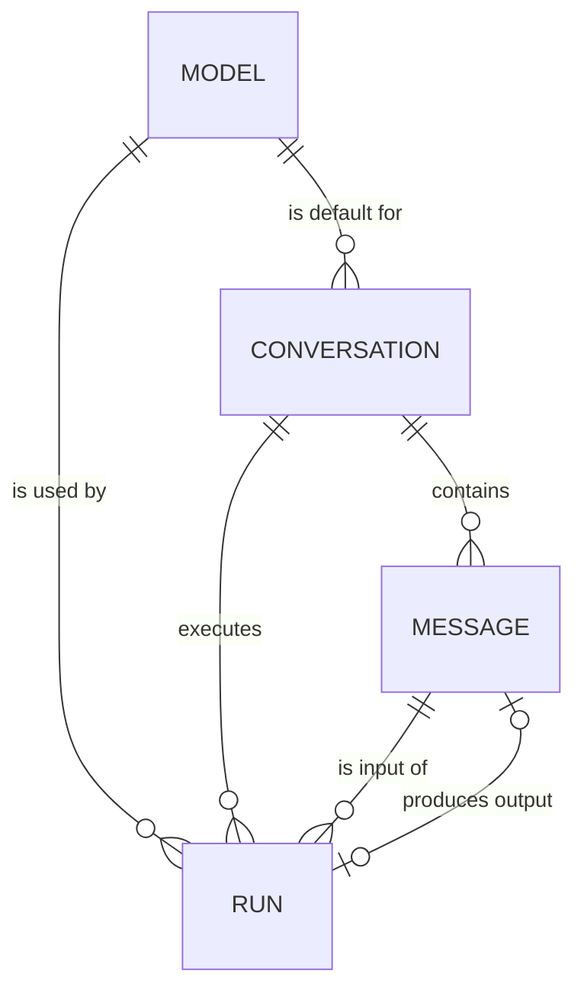
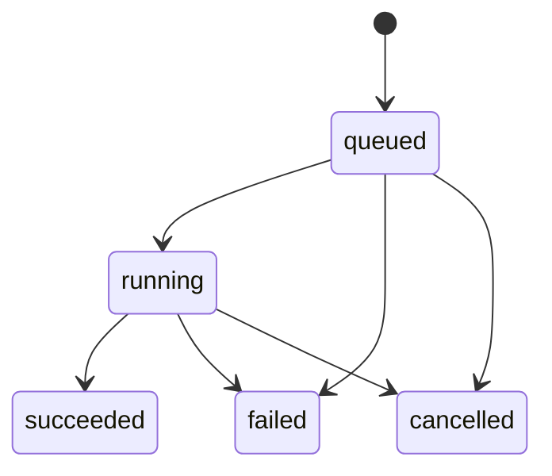
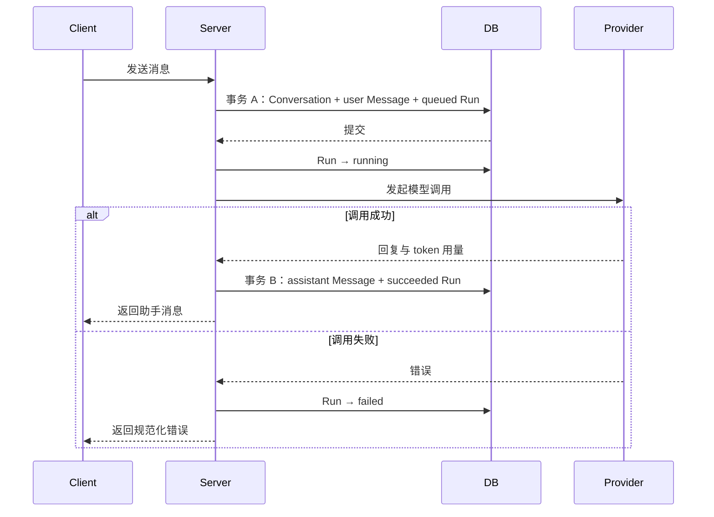

# 数据库设计

## 1. 设计说明

- 数据库使用 PostgreSQL，应用层通过 Prisma 访问。
- 当前阶段不维护 `User`、`App` 实体；`userId`、`appId` 保存外部业务系统传入的标识。
- 所有业务主键使用 UUID。Prisma 字段使用 camelCase，数据库表名和列名使用 snake_case。
- 时间字段使用 `timestamptz(3)`，统一写入 UTC，展示时由客户端转换时区。
- 当前核心实体为 `Model`、`Conversation`、`Message`、`Run`。
- `Message` 只保存对话内容，`Run` 保存一次模型调用的执行状态、模型和用量。一次用户消息可以因重试或重新生成产生多个 Run。
- Provider 凭据只允许通过 Server 环境变量或后续的密钥管理服务读取，不写入数据库。

当前 `POST /api/v1/chat/messages` 还是无持久化的占位实现，也没有接收 `userId`、`appId`。接入数据库前，Server 必须从可信的认证上下文取得这两个值，或同步调整 API；不能只根据客户端传入的 `conversationId` 判断会话归属。

## 2. ER 关系



关系说明：

- 一个 Conversation 必须选择一个默认 Model；修改默认模型只影响后续 Run。
- 一个 Conversation 包含多条 Message 和多次 Run。
- 一个用户 Message 可以对应多个 Run，以支持失败重试和重新生成。
- 一个 Run 在成功后最多产生一条助手 Message，一条助手 Message 最多属于一个 Run。
- Run 单独保存实际使用的 `modelId`，因此即使 Conversation 后续切换默认模型，历史调用仍然可追溯。

## 3. 表结构

以下“字段”列使用 Prisma 字段名；括号内是映射后的 PostgreSQL 列名。

### 3.1 models

模型目录。它描述 Server 可以调用的模型，不保存 API Key 等凭据。

| 字段                                    | PostgreSQL 类型  | Nullable | 默认值              | 约束                          | 说明                                            |
| --------------------------------------- | ---------------- | -------- | ------------------- | ----------------------------- | ----------------------------------------------- |
| `id`                                    | `uuid`           | 否       | `gen_random_uuid()` | PK                            | 模型内部 ID                                     |
| `provider`                              | `varchar(50)`    | 否       | —                   | 与 `providerModelId` 联合唯一   | Provider 标识，如 `deepseek`                    |
| `providerModelId` (`provider_model_id`) | `varchar(100)`   | 否       | —                   | 与 `provider` 联合唯一          | Provider 侧的模型 ID，如 `deepseek-chat`        |
| `displayName` (`display_name`)          | `varchar(100)`   | 否       | —                   | —                             | 前端展示名称                                    |
| `description`                           | `text`           | 是       | `NULL`              | —                             | 模型说明                                        |
| `contextWindow` (`context_window`)      | `integer`        | 是       | `NULL`              | `> 0`                         | 上下文窗口；未知时为空                          |
| `maxOutputTokens` (`max_output_tokens`) | `integer`        | 是       | `NULL`              | `> 0`                         | 最大输出 token 数；未知时为空                   |
| `capabilities`                          | `jsonb`          | 否       | `'{}'::jsonb`       | 必须是 JSON object             | 能力元数据，如是否支持 tools、vision、streaming |
| `isEnabled` (`is_enabled`)              | `boolean`        | 否       | `true`              | —                             | 是否允许创建新的 Run                            |
| `sortOrder` (`sort_order`)              | `integer`        | 否       | `0`                 | —                             | 模型列表展示顺序                                |
| `createdAt` (`created_at`)              | `timestamptz(3)` | 否       | `now()`             | —                             | 创建时间                                        |
| `updatedAt` (`updated_at`)              | `timestamptz(3)` | 否       | `now()`             | —                             | 更新时间，由 Prisma `@updatedAt` 维护           |

`provider` 使用字符串而不是数据库枚举，避免每接入一个 Provider 都执行枚举迁移。`capabilities` 只保存低频、结构可能变化的能力信息；需要查询或约束的稳定属性应提升为普通列。

### 3.2 conversations

会话是消息和调用记录的聚合根。`userId + appId` 构成租户查询边界，但不要求全局唯一：同一用户在同一应用下可以创建多个会话。

| 字段                       | PostgreSQL 类型  | Nullable | 默认值              | 约束                                   | 说明                   |
| -------------------------- | ---------------- | -------- | ------------------- | -------------------------------------- | ---------------------- |
| `id`                       | `uuid`           | 否       | `gen_random_uuid()` | PK                                     | 会话 ID                |
| `userId` (`user_id`)       | `varchar(100)`   | 否       | —                   | —                                      | 外部用户标识           |
| `appId` (`app_id`)         | `varchar(100)`   | 否       | —                   | —                                      | 外部应用标识           |
| `modelId` (`model_id`)     | `uuid`           | 否       | —                   | FK → `models.id`，`ON DELETE RESTRICT` | 后续回复默认使用的模型 |
| `title`                    | `varchar(100)`   | 否       | `'新会话'`           | 非空白字符串                             | 会话标题               |
| `createdAt` (`created_at`) | `timestamptz(3)` | 否       | `now()`             | —                                      | 创建时间               |
| `updatedAt` (`updated_at`) | `timestamptz(3)` | 否       | `now()`             | —                                      | 最近活动时间           |

`updatedAt` 用于会话列表排序。新增 Message、完成或失败 Run、修改标题、切换默认模型时，服务层都应显式更新该字段。仅依赖 Prisma `@updatedAt` 不会在新增子表记录时自动更新 Conversation。

### 3.3 messages

消息表示用户输入或已落库的助手输出。当前阶段只支持纯文本消息。

| 字段                                 | PostgreSQL 类型  | Nullable | 默认值              | 约束                                         | 说明     |
| ------------------------------------ | ---------------- | -------- | ------------------- | -------------------------------------------- | -------- |
| `id`                                 | `uuid`           | 否       | `gen_random_uuid()` | PK                                           | 消息 ID  |
| `conversationId` (`conversation_id`) | `uuid`           | 否       | —                   | FK → `conversations.id`，`ON DELETE CASCADE` | 所属会话 |
| `role`                               | `message_role`   | 否       | —                   | 枚举：`user`、`assistant`                     | 消息角色 |
| `content`                            | `text`           | 否       | —                   | 非空白字符串                                   | 消息正文 |
| `createdAt` (`created_at`)           | `timestamptz(3)` | 否       | `now()`             | —                                            | 创建时间 |

模型信息不在 Message 中重复保存。查询助手消息的 `modelId` 时，通过 `runs.output_message_id` 关联 Run 获取。这样可以避免 Message 与 Run 中的模型信息不一致。

如果后续支持 system、tool 或多模态消息，再扩展 `message_role`，并引入 MessagePart/Attachment；当前不提前用 JSON 承载这些结构。

### 3.4 runs

Run 表示一次完整的模型调用。输入消息写入后立即创建 Run，模型调用成功、失败或取消都必须留下最终状态。

| 字段                                        | PostgreSQL 类型  | Nullable | 默认值              | 约束                                           | 说明                                  |
| ------------------------------------------- | ---------------- | -------- | ------------------- | ---------------------------------------------- | ------------------------------------- |
| `id`                                        | `uuid`           | 否       | `gen_random_uuid()` | PK                                             | Run ID                                |
| `conversationId` (`conversation_id`)        | `uuid`           | 否       | —                   | FK → `conversations.id`，`ON DELETE CASCADE`   | 所属会话                              |
| `inputMessageId` (`input_message_id`)       | `uuid`           | 否       | —                   | FK → `messages.id`，`ON DELETE RESTRICT`       | 本次调用的用户消息                    |
| `outputMessageId` (`output_message_id`)     | `uuid`           | 是       | `NULL`              | FK → `messages.id`，`ON DELETE RESTRICT`；唯一  | 成功生成的助手消息                    |
| `modelId` (`model_id`)                      | `uuid`           | 否       | —                   | FK → `models.id`，`ON DELETE RESTRICT`         | 本次实际使用的模型                    |
| `status`                                    | `run_status`     | 否       | `queued`            | 枚举                                            | 执行状态                              |
| `providerRequestId` (`provider_request_id`) | `varchar(200)`   | 是       | `NULL`              | —                                              | Provider 返回的请求 ID，用于排障      |
| `promptTokens` (`prompt_tokens`)            | `integer`        | 是       | `NULL`              | `>= 0`                                         | 输入 token 数                         |
| `completionTokens` (`completion_tokens`)    | `integer`        | 是       | `NULL`              | `>= 0`                                         | 输出 token 数                         |
| `errorCode` (`error_code`)                  | `varchar(100)`   | 是       | `NULL`              | —                                              | 规范化错误码                          |
| `errorMessage` (`error_message`)            | `text`           | 是       | `NULL`              | —                                              | 脱敏后的错误摘要                      |
| `startedAt` (`started_at`)                  | `timestamptz(3)` | 是       | `NULL`              | —                                              | 开始调用 Provider 的时间              |
| `finishedAt` (`finished_at`)                | `timestamptz(3)` | 是       | `NULL`              | —                                              | 进入终态的时间                        |
| `createdAt` (`created_at`)                  | `timestamptz(3)` | 否       | `now()`             | —                                              | 创建时间                              |
| `updatedAt` (`updated_at`)                  | `timestamptz(3)` | 否       | `now()`             | —                                              | 更新时间，由 Prisma `@updatedAt` 维护 |

业务约束：

- `inputMessageId` 必须指向同一 Conversation 中 `role = user` 的消息。
- `outputMessageId` 必须指向同一 Conversation 中 `role = assistant` 的消息。
- 所有终态都必须有 `finishedAt`；`succeeded` 必须有 `outputMessageId`，`failed` 必须有 `errorCode`，非成功状态不得有 `outputMessageId`。
- token 用量以 Provider 实际返回值为准，Provider 不返回时保持 `NULL`，不要用 `0` 表示未知。
- `errorMessage` 不得包含 API Key、完整请求头或其他敏感信息。

角色与跨表状态约束无法只靠普通外键完整表达，当前由事务内的服务层校验；需要防御绕过应用的直接写入时，可在 migration 中增加复合外键、约束触发器或数据库函数。

## 4. 枚举与状态

### 4.1 `message_role`
 
| 值          | 说明                     |
| ----------- | ------------------------ |
| `user`      | 用户输入                 |
| `assistant` | 模型生成并已持久化的回复 |

### 4.2 `run_status`

| 值          | 是否终态 | 说明                          |
| ----------- | -------- | ----------------------------- |
| `queued`    | 否       | Run 已创建，等待调用 Provider |
| `running`   | 否       | Provider 调用已开始           |
| `succeeded` | 是       | 调用成功，助手 Message 已写入 |
| `failed`    | 是       | 调用失败，错误信息已记录      |
| `cancelled` | 是       | 用户或系统主动取消            |

允许的状态转换：



终态不可再次修改。重试失败调用时应新建 Run，并继续引用原 `inputMessageId`，而不是把原 Run 改回 `queued`。服务启动后可扫描长时间停留在 `queued`、`running` 的记录，根据 Provider 的查询能力恢复或标记为 `failed`。

## 5. 外键与数据关系

| 子表字段                   | 父表字段           | 删除策略   | 原因                              |
| -------------------------- | ------------------ | ---------- | --------------------------------- |
| `conversations.model_id`   | `models.id`        | `RESTRICT` | 历史会话仍需展示默认模型          |
| `messages.conversation_id` | `conversations.id` | `CASCADE`  | 删除会话时消息失去业务意义        |
| `runs.conversation_id`     | `conversations.id` | `CASCADE`  | 删除会话时同时删除执行记录        |
| `runs.input_message_id`    | `messages.id`      | `RESTRICT` | 防止单独删除输入消息导致 Run 悬空 |
| `runs.output_message_id`   | `messages.id`      | `RESTRICT` | 防止单独删除输出消息破坏审计链路  |
| `runs.model_id`            | `models.id`        | `RESTRICT` | 保留历史调用实际模型              |

PostgreSQL 不会自动为外键列创建索引，因此所有高频关联和删除检查涉及的外键都要按第 6 节显式建索引。

应用访问 Conversation、Message 或 Run 时必须同时校验 `userId + appId`。推荐从 Conversation 作为入口做关联查询，避免先按全局 ID 查出资源后再补做归属判断。

## 6. 索引设计

### 6.1 索引列表

| 表              | 索引                                          | 类型                | 用途                             |
| --------------- | --------------------------------------------- | ------------------- | -------------------------------- |
| `models`        | `(provider, provider_model_id)`               | UNIQUE              | 防止同一 Provider 重复注册模型   |
| `models`        | `(is_enabled, sort_order, id)`                | B-tree              | 获取可用模型列表并稳定排序       |
| `conversations` | `(user_id, app_id, updated_at DESC, id DESC)` | B-tree              | 租户内会话列表与游标分页         |
| `conversations` | `(model_id)`                                  | B-tree              | 外键检查、模型引用查询           |
| `messages`      | `(conversation_id, created_at DESC, id DESC)` | B-tree              | 查询会话消息与游标分页           |
| `runs`          | `(conversation_id, created_at DESC, id DESC)` | B-tree              | 查询会话执行历史                 |
| `runs`          | `(input_message_id, created_at DESC)`         | B-tree              | 查询某条输入的重试/重新生成记录  |
| `runs`          | `(output_message_id)`                         | UNIQUE，允许 `NULL`  | 保证一条助手消息最多属于一个 Run |
| `runs`          | `(model_id)`                                  | B-tree              | 外键检查、按模型统计调用         |
| `runs`          | `(status, created_at)`                        | B-tree              | 扫描待执行或超时 Run             |

不要为低选择性的 `role`、`is_enabled` 单独创建索引。只有在真实查询和 `EXPLAIN ANALYZE` 证明有收益后，才增加 JSONB GIN 索引或按状态创建部分索引。

### 6.2 为什么 conversations 使用 `userId + appId + updatedAt`

- `userId + appId` 是当前架构下的租户边界，可把扫描范围限定到某个用户在某个应用中的会话。
- 会话列表按最近活动时间倒序展示，`updatedAt` 可以直接提供所需顺序。
- 多条记录可能有相同的 `updatedAt`，因此追加唯一的 `id` 作为稳定排序和游标的决胜字段。
- 索引最左侧必须保留 `userId + appId`；只用 `updatedAt` 会扫描其他租户的数据，既低效也容易造成越权查询实现错误。

### 6.3 为什么 messages 使用 `conversationId + createdAt`

- 消息读取总是限定在单个 Conversation，`conversationId` 是最高效的前缀过滤条件。
- `createdAt` 对应消息的时间顺序，能够避免数据库额外排序。
- `createdAt` 不保证唯一，所以实际索引和排序都追加 `id`。

### 6.4 Cursor pagination 如何使用索引

游标采用不透明的 Base64URL 字符串，内部至少包含排序字段和唯一 ID。例如会话游标解码后为：

```json
{
  "updatedAt": "2026-08-12T10:00:00.000Z",
  "id": "0198d5c4-7c83-7a21-8b79-9f5f116e5e58"
}
```

会话列表查询逻辑：

```sql
SELECT *
FROM conversations
WHERE user_id = $1
  AND app_id = $2
  AND (updated_at, id) < ($3, $4)
ORDER BY updated_at DESC, id DESC
LIMIT $5 + 1;
```

首次请求省略游标条件。多取一条用于计算 `hasMore`，返回前移除多取的记录，并将本页最后一条记录的 `updatedAt + id` 编码为 `nextCursor`。服务端需要校验游标结构、时间和 UUID；无效游标返回 `400`。

消息使用相同模式，以 `(createdAt, id)` 为游标，按倒序读取最新历史；API 返回给聊天界面前可以反转当前页，使页面内仍按时间正序显示。相较 `OFFSET`，Keyset/Cursor pagination 不会随着页数增加而扫描并丢弃大量旧记录，也能减少并发插入造成的重复和遗漏。

会话的 `updatedAt` 会变化，因此跨页读取期间活跃会话可能移动到前面。列表接口接受这种“最近活动优先”的弱一致性；如果以后需要严格快照，应在首个游标中加入查询水位或使用独立的不可变排序字段。

## 7. 数据生命周期与删除策略

当前阶段采用以下策略：

- Conversation 使用硬删除。删除前必须校验 `userId + appId`，然后在事务中先删除 Run、再删除 Message、最后删除 Conversation。这个显式顺序可满足 Run 到 Message 的 `RESTRICT` 约束；Conversation 外键上的 `CASCADE` 作为完整性兜底。
- 不提供单条 Message 或 Run 删除接口，避免破坏上下文和执行链路。
- Model 不做物理删除；下线模型时将 `isEnabled` 设为 `false`。已有 Conversation 和 Run 仍可读取该模型，创建新 Run 时必须拒绝已停用模型。
- `failed`、`cancelled` Run 与成功 Run 一样保留，便于排障和统计。
- 日志和 `errorMessage` 只保留脱敏摘要，不保存 Provider 凭据。

删除 Conversation 是不可恢复操作，服务层应在一个事务中执行，并记录不含消息正文的审计日志。后续如引入恢复站、合规保留期或用户数据导出，再增加 `deletedAt`、后台清理任务和对象存储清理流程；当前不同时维护软删除和硬删除两套语义。

## 8. 数据写入流程

一次新消息的推荐写入流程如下：

1. Server 从认证上下文取得 `userId`、`appId`，校验输入内容。
2. 如果未传 `conversationId`，选择一个启用的默认 Model，并在短事务中创建 Conversation、用户 Message 和状态为 `queued` 的 Run。首条消息可以截断后作为初始标题。
3. 如果传入 `conversationId`，用 `conversationId + userId + appId` 查询 Conversation，确认其默认 Model 仍启用；在短事务中创建用户 Message、Run，并更新 Conversation 的 `updatedAt`。
4. 提交事务后，将 Run 更新为 `running` 和 `startedAt`，再调用 Provider。网络调用不得占用数据库事务。
5. 调用成功后，在一个事务中创建助手 Message，将 Run 更新为 `succeeded`，写入 `outputMessageId`、token 用量和 `finishedAt`，同时更新 Conversation 的 `updatedAt`。
6. 调用失败时，将 Run 更新为 `failed`，记录规范化且脱敏的错误与 `finishedAt`；用户 Message 继续保留，以便重试。
7. 用户取消时，将非终态 Run 条件更新为 `cancelled`。Provider 返回较晚结果时，使用带当前状态条件的更新避免覆盖终态。



实现时还应考虑：

- 对发送接口增加幂等键，防止客户端超时重试造成重复 Message 和 Run。
- 同一 Conversation 的并发发送应明确策略。当前建议串行执行，避免上下文截取和回复顺序不一致。
- 长上下文组装只读取已持久化的 Message；失败 Run 不会产生助手 Message，因此不会污染后续上下文。
- 数据库事务只覆盖本地一致性写入，不跨越 Provider 网络调用。

## 9. 后续规划

暂不实现：

- `users`、`apps`：接入统一身份与租户系统后，再把外部标识升级为外键。
- `attachments`、`message_parts`：支持图片、文件、音频和结构化消息。
- Provider credentials：接入专用密钥管理服务，不在普通业务表中保存明文凭据。
- Tool call、tool result 和 system Message。
- 对话分支、编辑历史和多候选回复。
- 流式输出分片持久化与断线续传。
- 用量计费、价格快照、预算和配额。
- 软删除、恢复站、数据保留策略和审计事件表。
- Embedding、全文检索与向量检索。

在实现这些能力前，先以真实查询执行计划、数据规模和产品需求验证是否需要分区、读副本、缓存或额外索引，避免过早复杂化数据库模型。
